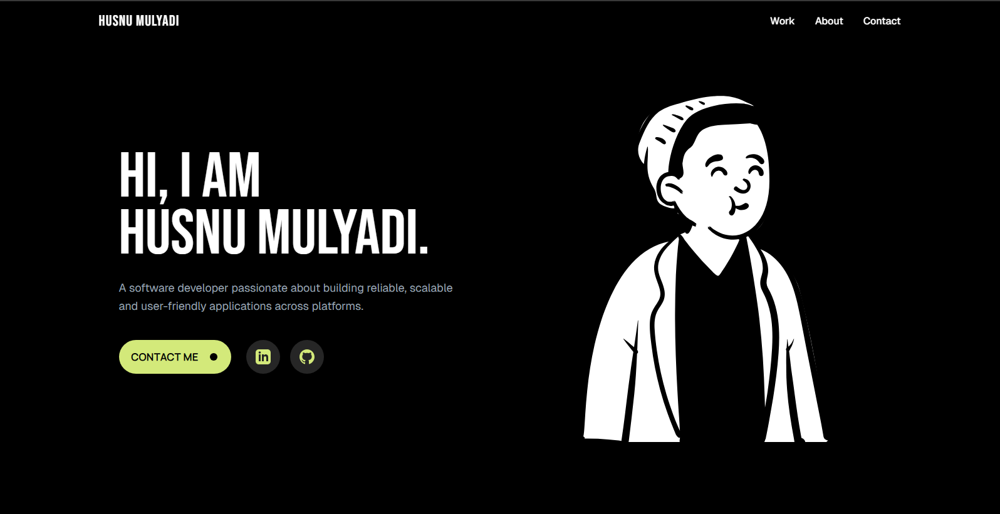

# Husnu Mulyadi - Personal Portfolio Website

<div align="center">
  
[](https://nextjs.org/)
[](https://reactjs.org/)
[](https://tailwindcss.com/)
[](https://www.typescriptlang.org/)

</div>

---

### [View Live Demo](https://your-live-demo-url.com) <!-- Ganti dengan URL demo langsung Anda -->

 <!-- Ganti dengan path screenshot Anda -->

## 📖 About The Project

Selamat datang di repositori portofolio pribadi saya! Proyek ini adalah situs web yang modern, responsif, dan berkinerja tinggi yang dibangun dengan Next.js. Situs ini berfungsi sebagai platform untuk memamerkan proyek-proyek unggulan, keterampilan teknis, dan sebagai sarana bagi pengunjung untuk terhubung dengan saya melalui formulir kontak.

Fokus utama proyek ini adalah pada pengalaman pengguna yang luar biasa, kinerja pemuatan yang cepat, dan praktik pengembangan modern.

---

## 📜 Table of Contents

- [✨ Features & Implementation Details](#✨-features--implementation-details)
- [🛠️ Built With](#🛠️-built-with)
- [🚀 Getting Started](#🚀-getting-started)
- [🧪 Running Tests](#🧪-running-tests)
- [✒️ Author](#✒️-author)
- [📝 License](#📝-license)

---

## ✨ Features & Implementation Details

Berikut adalah rincian fitur utama proyek ini dan bagaimana mereka diimplementasikan secara teknis.

- ### ⚡ Lazy Loading dengan Skeleton Placeholder
  - **Deskripsi**: Komponen `FeaturedProjects` yang berpotensi berat tidak dimuat bersamaan dengan halaman utama. Sebagai gantinya, ia dimuat secara dinamis hanya ketika dibutuhkan oleh klien, dengan *skeleton loader* yang elegan ditampilkan selama proses pemuatan.
  - **Implementasi**: Fitur ini dicapai menggunakan `next/dynamic`. Dengan membungkus impor komponen dalam `dynamic()`, Next.js akan memisahkannya ke dalam *chunk* JavaScript-nya sendiri. Opsi `ssr: false` digunakan untuk memastikan komponen ini hanya dirender di sisi klien, dan properti `loading` diisi dengan komponen *skeleton* kustom yang memberikan umpan balik visual yang modern.
    ```jsx
    // di app/page.tsx
    const FeaturedProjects = dynamic(
      () => import('./components/FeaturedProjects'),
      { 
        ssr: false,
        loading: () => <FeaturedProjectsSkeleton /> 
      }
    );
    ```

- ### 🔍 Pencarian Proyek Dinamis & Efisien
  - **Deskripsi**: Pengguna dapat secara instan memfilter daftar proyek dengan mengetik di kolom pencarian.
  - **Implementasi**: State untuk istilah pencarian dikelola menggunakan hook `useState`. Logika pemfilteran itu sendiri dibungkus dalam hook `useMemo`. `useMemo` akan mengingat (memoize) hasil dari daftar proyek yang difilter dan hanya akan menjalankan kembali logika pemfilteran jika *array* proyek atau istilah pencarian berubah. Ini adalah optimasi kinerja yang penting untuk mencegah kalkulasi ulang yang mahal pada setiap render.
    ```jsx
    // di components/FeaturedProjects.tsx
    const filteredProjects = useMemo(() => {
      return projects.filter(project =>
        project.title.toLowerCase().includes(searchTerm.toLowerCase())
      );
    }, [searchTerm, projects]);
    ```

- ### 📝 Manajemen State Tingkat Lanjut dengan `useReducer`
  - **Deskripsi**: Formulir kontak menggunakan pendekatan manajemen state yang terpusat untuk menangani input pengguna, status pengiriman (loading, success, error), dan umpan balik.
  - **Implementasi**: Hook `useReducer` digunakan untuk mengelola semua state yang terkait dengan formulir. Sebuah fungsi `reducer` mendefinisikan semua transisi state yang mungkin (misalnya, `UPDATE_FIELD`, `SUBMIT`, `SUCCESS`). Ini membuat logika state lebih mudah diprediksi, diuji, dan dikelola dibandingkan dengan menggunakan beberapa `useState`.
    ```jsx
    // di components/Contact.tsx
    const formReducer = (state, action) => {
      switch (action.type) {
        case 'UPDATE_FIELD': return { ... };
        case 'SUBMIT': return { ... };
        // ... kasus lainnya
      }
    };
    const [state, dispatch] = useReducer(formReducer, initialState);
    ```

- ### 👋 Pesan Selamat Datang Berbasis Sesi
  - **Deskripsi**: Untuk meningkatkan pengalaman pengguna baru, sebuah pesan selamat datang dengan animasi akan muncul hanya satu kali per sesi browser.
  - **Implementasi**: Fitur ini menggunakan `sessionStorage` untuk 'mengingat' apakah pesan selamat datang sudah ditampilkan. Di dalam hook `useEffect`, kode akan memeriksa `sessionStorage` untuk sebuah *key* tertentu. Jika *key* tersebut tidak ada, pesan akan ditampilkan, dan *key* akan diatur. Jika *key* sudah ada, pesan tidak akan ditampilkan lagi. Ini memastikan pesan tidak mengganggu pada navigasi halaman berikutnya dalam sesi yang sama.
    ```jsx
    // Logika di dalam komponen WelcomeMessage
    useEffect(() => {
      const hasBeenShown = sessionStorage.getItem('welcomeMessageShown');
      if (!hasBeenShown) {
        setShowMessage(true);
        sessionStorage.setItem('welcomeMessageShown', 'true');
      }
    }, []);
    ```

- ### ✅ Pengujian Feature (Testing)
  - **Deskripsi**: Komponen `FeaturedProjects` memiliki serangkaian tes untuk memverifikasi fungsionalitas rendering dan pencarian.
  - **Implementasi**: Menggunakan **Jest** sebagai *test runner* dan **React Testing Library** untuk merender komponen di lingkungan tes. Tes ditulis dalam file `*.test.tsx`. Fungsi seperti `render`, `screen`, dan `fireEvent` digunakan untuk mensimulasikan interaksi pengguna dan membuat *assertion* tentang output DOM.
    ```jsx
    // di components/__tests__/FeaturedProjects.test.tsx
    test('filters projects based on search input', () => {
      render(<FeaturedProjects />);
      const searchInput = screen.getByPlaceholderText('Search projects by title...');
      fireEvent.change(searchInput, { target: { value: 'Pokémon' } });
      expect(screen.getByText('Pokémon Web Explorer')).toBeInTheDocument();
    });
    ```

- ### 🔎 SEO & Social Media Friendly
  - **Deskripsi**: Situs ini dioptimalkan untuk mesin pencari dan pratinjau media sosial yang kaya.
  - **Implementasi**: Menggunakan **Next.js Metadata API**. Sebuah objek `metadata` diekspor dari `app/layout.tsx`. Objek ini berisi `title`, `description`, `keywords`, dan objek `openGraph` serta `twitter` yang akan secara otomatis menghasilkan tag `<meta>` yang sesuai di `<head>` dokumen, memastikan tampilan yang optimal di Google dan saat dibagikan di media sosial.

---

## 🛠️ Built With

Daftar teknologi dan pustaka utama yang digunakan dalam proyek ini.

- [Next.js](https://nextjs.org/)
- [React](https://reactjs.org/)
- [TypeScript](https://www.typescriptlang.org/)
- [Tailwind CSS](https://tailwindcss.com/)
- [Jest](https://jestjs.io/)
- [React Testing Library](https://testing-library.com/)
- [Lucide React](https://lucide.dev/)

---

## 🚀 Getting Started

Ikuti langkah-langkah ini untuk menjalankan salinan lokal dari proyek ini.

### Prerequisites

Pastikan Anda memiliki Node.js (versi 20.x atau lebih baru) dan npm terinstal di mesin Anda.

- [Node.js](https://nodejs.org/)
- [npm](https://www.npmjs.com/get-npm)

### Installation

1.  **Clone repositori ini**
    ```sh
    git clone https://github.com/your-username/your-repo-name.git
    ```
2.  **Masuk ke direktori proyek**
    ```sh
    cd your-repo-name
    ```
3.  **Instal dependensi npm**
    ```sh
    npm install
    ```
4.  **Jalankan server pengembangan**
    ```sh
    npm run dev
    ```

Buka [http://localhost:3000](http://localhost:3000) di browser Anda untuk melihat hasilnya.

---

## 🧪 Running Tests

Proyek ini menggunakan Jest dan React Testing Library untuk pengujian unit. Untuk menjalankan tes, gunakan perintah berikut:

```sh
npm test
```

Untuk menjalankan tes dalam *watch mode*:

```sh
npm run test:watch
```

---

## ✒️ Author

- **Husnu Mulyadi**
- **NIM**: 23523118
- **Kelas**: WCD-07

Terhubung dengan saya:

[](https://www.linkedin.com/in/your-linkedin-profile/) <!-- Ganti dengan URL profil LinkedIn Anda -->
[](https://github.com/your-username) <!-- Ganti dengan URL profil GitHub Anda -->

---

## 📝 License

Proyek ini dilisensikan di bawah Lisensi MIT. Lihat file `LICENSE` untuk detail lebih lanjut.